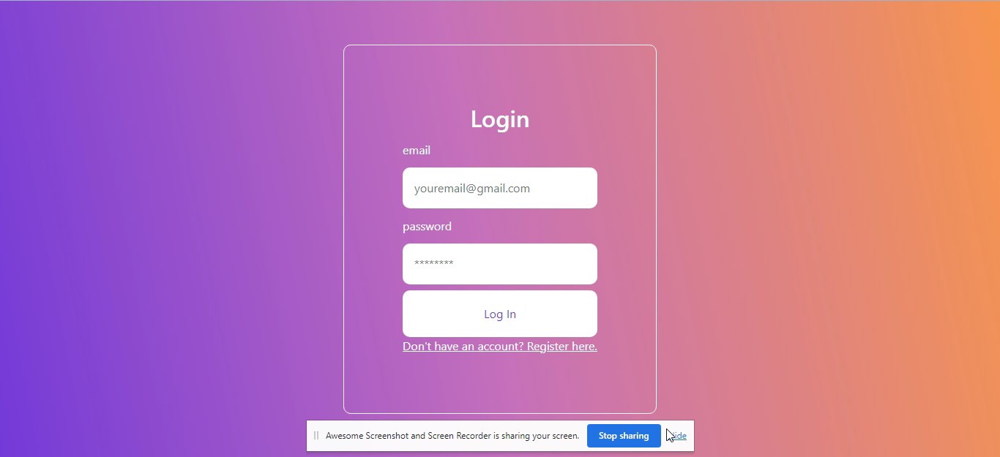
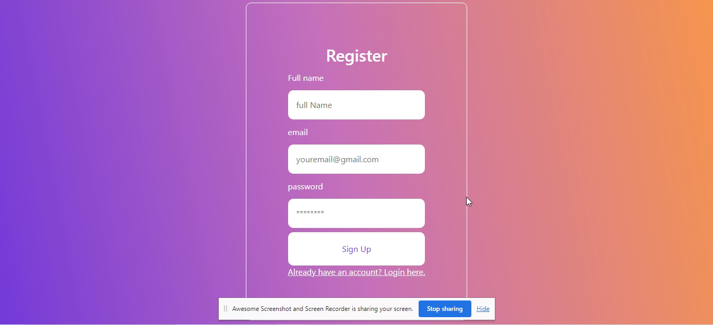

# Make sure to check Backend Repository :
https://github.com/insh007/AegisCovenant-Backend

# Current Frontend Repository :
https://github.com/insh007/AegisCovenant---Frontend

# Deploy Backend Link :
https://ages-covenant-api.onrender.com

# Deploy Frontend Link :
https://ages-covenants-app.onrender.com

###### Screenshot 1

 
 
 

###### Screenshot 2

 
 
 

###### Screenshot 3

 
 
 

###### Screenshot 4

 
 
 

# Installation and Setup
1. Clone the repository to your local machine.
2. Run npm install to install the dependencies.
3. Run npm run dev to start the app.

# Usage
1. Navigate to the Home page using the navbar if you have registerd otherwise need to registered first.
2. Fill out the form with a source, destination, and date to see the flights prices.
3. Result will render to the left side after clicking on Go.

# Technologies Used
1. MongoDB: a NoSQL database used for storing and retrieving data
2. Express.js: a web application framework for Node.js
3. React: a JavaScript library for building user interfaces
4. Node.js: a JavaScript runtime environment for running server-side code
5. HTML & CSS: for building web pages